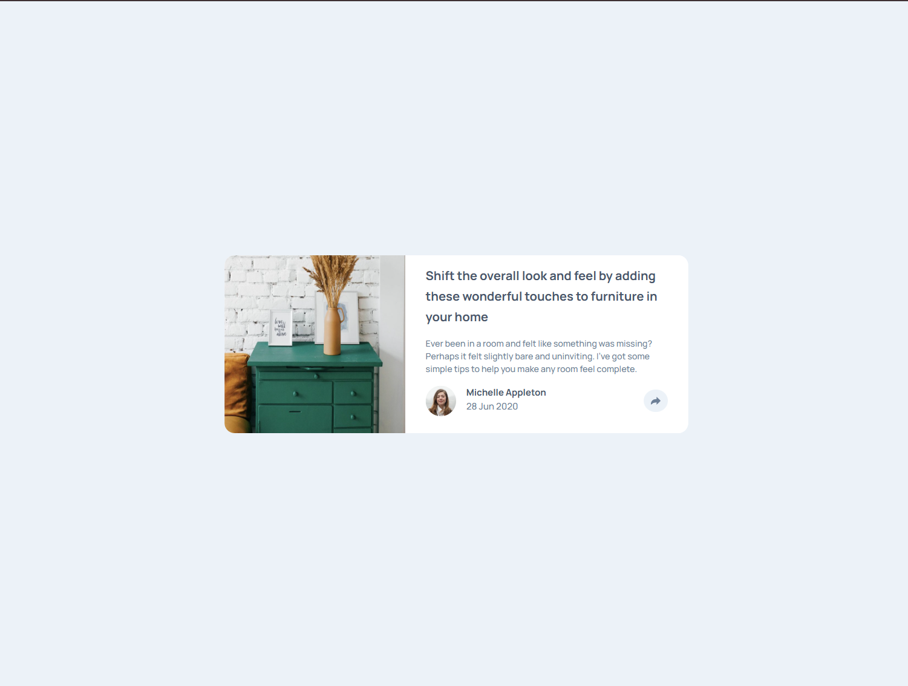

# Article Preview Component

This is a responsive Article Preview Component that features a share button to toggle a social media popup. It was built using HTML, CSS, and JavaScript with a focus on achieving a pixel-perfect layout across different devices.

## Live Demo

Check out the live demo here: [Article Preview Component](https://jayco01.github.io/article-preview-component/)

## Screenshot



## Features

- **Responsive Design:** Adjusts seamlessly for mobile, tablet, and desktop screen sizes.
- **Share Popup Toggle:** Click the share button to reveal or hide the social media icons.
- **Precise Positioning:** Utilizes absolute positioning to place active elements exactly where needed.
- **Chrome DevTools:** Leveraged for fine-tuning the layout and achieving pixel-perfect positioning.
- **First-Time JavaScript Use:** Introduced basic JavaScript concepts like DOM manipulation and event handling.

## Getting Started

Follow these steps to clone and run the project locally:

1. **Clone the Repository:**

   ```bash
   git clone https://github.com/jayco01/article-preview-component.git
   ```

2. **Navigate to the Project Directory:**

   ```bash
   cd article-preview-component
   ```

3. **Open the Project:**

   Open the `index.html` file in your favorite web browser. You can also use a live server extension in your code editor for a better development experience.

## Technologies Used

- **HTML5**
- **CSS3**
- **JavaScript**
- **Google Chrome DevTools**

## Challenges & Lessons Learned

- **JavaScript Toggle Feature:** Learning to implement the toggle functionality for the share popup was challenging at first. Through debugging and experimentation, I learned how to manipulate DOM elements and toggle CSS classes to show or hide content.
- **Absolute Positioning in CSS:** Achieving precise positioning of the active elements required a good understanding of absolute positioning. I relied on Google Chrome DevTools to experiment with and fine-tune the layout.
- **Responsive Design:** Ensuring the component looks great on all devices required careful planning and testing with media queries.

## Conclusion

This project was a great opportunity to improve my CSS skills and dive into JavaScript for interactivity. I enjoyed the process of learning and applying new techniques, and I hope you find the component both visually appealing and functionally engaging!